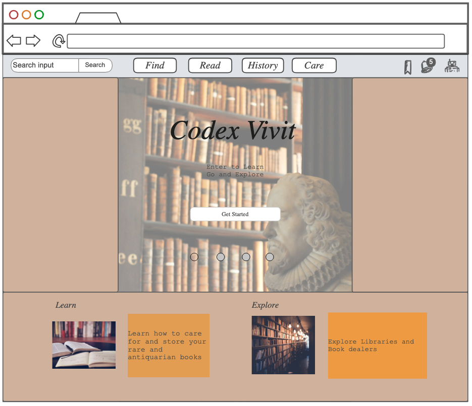

# <ins>Codex Vivit!</ins>

## Elevator Pitch
   As technology sprints into the future, many old knoledge gets left behing and forgotten. Much knowledge never even got the chance to be read. With <ins>Codex Vivit</ins>* we offer a place, using the latest in web technology to find, learn about, and study from antiquarian and rare codecies. Keeping old knowledge alive will give the future a grounding in the past and inspire the next generation.

   *Codex Vivit: Latin. The Codex Lives

## Key Features
   - Database of <ins>Rare and Antiquarian</ins> bookdealers
   - Database of online libraries to read photo copied rare book
   - Educational tool to learn how to care for rare and antiquarian books
   - History of the codex
   - Forum to discuss rare books
   - Bookmark your favorite pages, dealers, and libraries

## Use of Technologies
   ### HTML
- Structure multiple pages containing information
- Pages
	- Welcome page
	- Evolution of codices
	- Free photocopies of old text
	- Storage and care
	- Book dealers & Libraries
	- Forum? 
### CSS
- Format page to easily read text and display wrapped images
- Bootstrap menu to flip between pages
- pleasing fonts and colors
	- dark and light mode
### JavaScript & React
- Search bar for website information
- carrousel to select book dealers?
- Login
### Web service 
- Search book dealers and library websites
### Authentication
- Log into website
- Profile containing liked pages
- Liked dealers and libraries
### Database Data
- Book dealers and Libraries
### WebSocket Date
- Live updating forum

## Diagram

## Links
Startup project for CS 260 Fall '24
[Notes for CS 260](./notes.md)

## Update
css project
- Added navbar using bootstrap to all pages
- Created a main.css file to create a consistent style on all webpages
- Imported font from Google Fonts to use on the website
- Made the grid of links on index.html responsive to screen orientation
- Added favicon to all webpages

React Project
- Converted all html files to jsx
- Added a router to render each app component on a single web page
- Added react hooks to update and store login values
- Created a conditional display to display a username when logged in
- Created a dropdown for the username to go to their profile and logout

Service Project
- Called a quote api from the browser and displayed the quote on the home page
- Created a basic 'save search' feature in Book List that saves searches based on user name
- Serves those saved searches based on username and displays them in the app

Login Project
- Created a basic login and log out function
- Added backend MongoDB to save username, hashed password, and user id token
- Not being logged in limits you from accessing message board

